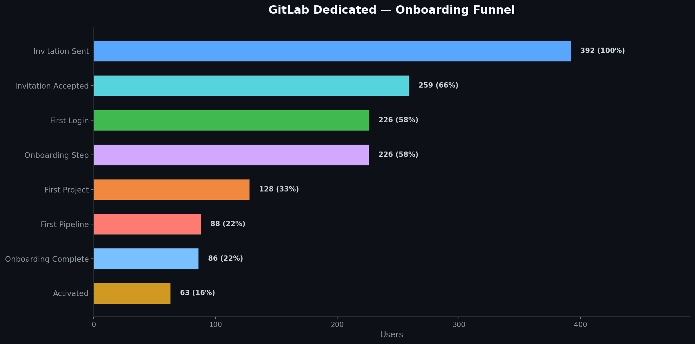
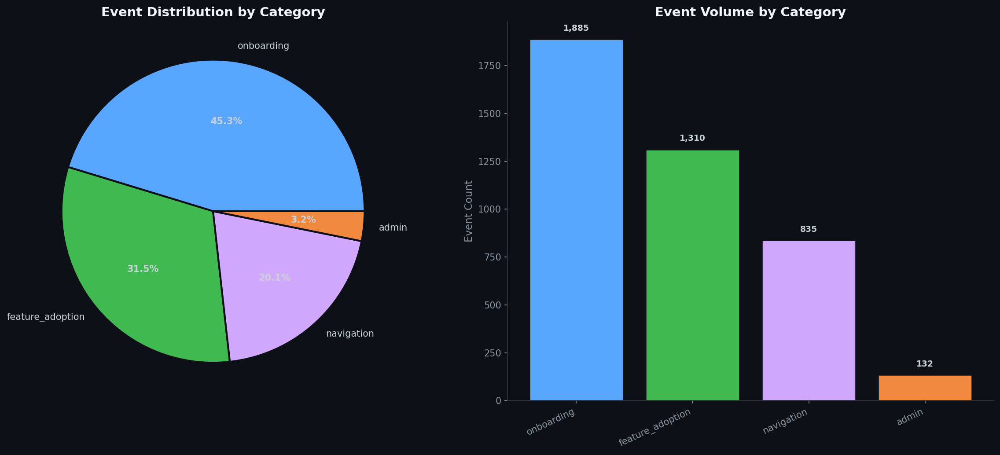
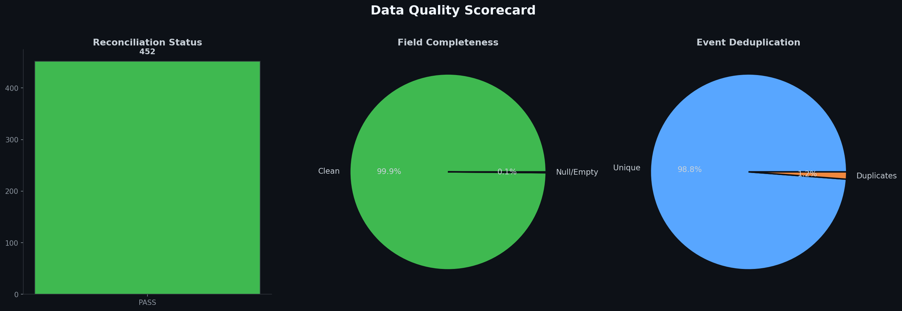
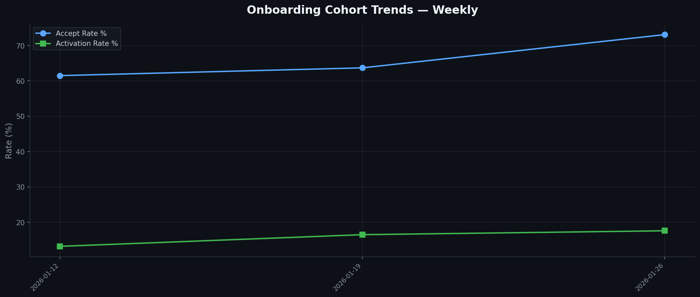

# 📊 Instrumentation Strategy for GitLab Dedicated Offerings

<div align="center">


*A comprehensive, end-to-end instrumentation strategy and analytics pipeline for GitLab's Dedicated (single-tenant SaaS) product tier.*

[Overview](#-overview) •
[Workstreams](#-workstreams) •
[Quick Start](#-quick-start) •
[Pipeline](#-pipeline-architecture) •
[Outputs](#-outputs) •
[Tech Stack](#-tech-stack)

</div>

---

## 🎯 Overview

GitLab Dedicated is an isolated, single-tenant SaaS offering that requires its own instrumentation layer — standard GitLab.com telemetry pipelines do not apply. Events must be tracked per-tenant while respecting **strict data residency** and **privacy constraints** (GDPR, SOC 2, FedRAMP, HIPAA).

This project delivers:
- **12 strategy deliverables** across 4 workstreams (documentation, templates, runbooks)
- **An executable Python pipeline** that generates synthetic data, validates quality, performs funnel analysis, and produces reports
- **Production-ready SQL schemas** and dbt model specifications for Snowflake

---

## 📋 Workstreams

### WS1 — Custom Tracking Templates
| Deliverable | Description |
|-------------|-------------|
| [Tracking Plan Template](workstream_1_tracking_templates/tracking_plan_template.md) | 15 instrumented events with properties, owners, priorities, and governance rules |
| [Event Taxonomy](workstream_1_tracking_templates/event_taxonomy.md) | `dedicated_{domain}_{object}_{action}` naming convention with 40+ categorized events |
| [Measurement Strategy](workstream_1_tracking_templates/measurement_strategy.md) | Strategic questions, scope, Dedicated vs. GitLab.com differences, compliance frameworks |

### WS2 — Data Validation & Reconciliation
| Deliverable | Description |
|-------------|-------------|
| [Reconciliation Runbook](workstream_2_data_validation/reconciliation_runbook.md) | Step-by-step raw → BI diff process with SQL, thresholds (<0.1% = PASS), and escalation |
| [SQL Validation Queries](workstream_2_data_validation/sql_validation_queries.sql) | 4 production SQL templates: row count reconciliation, null checks, dupe detection, coverage |
| [Discrepancy Resolution Log](workstream_2_data_validation/discrepancy_resolution_log.md) | Tracking table with sample entries, severity definitions, and weekly health summary |

### WS3 — Onboarding Friction Analysis
| Deliverable | Description |
|-------------|-------------|
| [Research Plan](workstream_3_onboarding_research/research_plan.md) | 5 hypotheses, primary/secondary metrics, 5 analysis methods, 4-week sprint timeline |
| [Funnel Analysis Template](workstream_3_onboarding_research/funnel_analysis_template.md) | 8-step onboarding funnel with SQL queries, benchmark targets, segmentation dimensions |
| [Insights Report Structure](workstream_3_onboarding_research/insights_report_structure.md) | Report outline with 8 specific interventions targeting 30% friction reduction |

### WS4 — Data Modeling Collaboration
| Deliverable | Description |
|-------------|-------------|
| [Data Modeling Requirements](workstream_4_data_modeling/data_modeling_requirements.md) | Entity definitions (ER diagram), SCD Type 2 design, data quality contracts |
| [Schema Design](workstream_4_data_modeling/schema_design.sql) | 5 `CREATE TABLE` statements (raw, fact, 3 dimensions) with dbt test specs |
| [Collaboration Checklist](workstream_4_data_modeling/collaboration_checklist.md) | 30+ review items across 7 categories with sign-off protocol |

---

## 🚀 Quick Start

### Prerequisites
- Python 3.12+
- pip

### Installation & Run

```bash
# Clone the repository
git clone https://github.com/yourusername/instrumentation-strategy-dedicated.git
cd instrumentation-strategy-dedicated

# Install dependencies
pip install -r requirements.txt

# Run the full pipeline
python3 main.py
```

The pipeline completes in **~6 seconds** and produces all outputs automatically.

---

## ⚙️ Pipeline Architecture

The executable pipeline runs **5 phases** sequentially:

```
┌─────────────────────────┐
│  PHASE 1: Data Gen      │  → 8 tenants, 392 users, 4,200+ events
│  data_generator.py      │    (with deliberate quality issues)
└────────────┬────────────┘
             ▼
┌─────────────────────────┐
│  PHASE 2: DB Setup      │  → DuckDB raw + analytics schemas
│  db_setup.py            │    Raw → Fact table transformation
└────────────┬────────────┘
             ▼
┌─────────────────────────┐
│  PHASE 3: Validation    │  → 4 SQL validation checks
│  validation_engine.py   │    Reconciliation, nulls, dupes, coverage
└────────────┬────────────┘
             ▼
┌─────────────────────────┐
│  PHASE 4: Funnel        │  → 8-step onboarding funnel
│  funnel_analysis.py     │    Time-to-complete, segments, cohorts
└────────────┬────────────┘
             ▼
┌─────────────────────────┐
│  PHASE 5: Reports       │  → Excel workbook (11 sheets)
│  report_generator.py    │    4 dark-themed matplotlib charts
└─────────────────────────┘
```

### Module Descriptions

| Module | Purpose |
|--------|---------|
| `config.py` | Central configuration — thresholds, event catalog, funnel benchmarks |
| `data_generator.py` | Synthetic data engine with realistic funnel drop-offs + injected quality issues |
| `db_setup.py` | DuckDB schema creation + raw → deduplicated fact table transformation |
| `validation_engine.py` | 4 SQL validation queries (reconciliation, nulls, duplicates, P0 coverage) |
| `funnel_analysis.py` | 8-step funnel, time-to-complete, role segmentation, weekly cohort analysis |
| `report_generator.py` | 11-sheet Excel workbook + 4 dark-themed matplotlib visualizations |
| `main.py` | Orchestrator — executes all 5 phases with rich console output |

---

## 📊 Outputs

### Visualizations

<div align="center">

#### Onboarding Funnel


#### Event Distribution by Category


#### Data Quality Scorecard


#### Weekly Cohort Trends


</div>

### Generated Files

| Output | Location |
|--------|----------|
| DuckDB Database | `dedicated_events.duckdb` |
| Excel Report (11 sheets) | `output/reports/instrumentation_strategy_report.xlsx` |
| Onboarding Funnel Chart | `output/charts/onboarding_funnel.png` |
| Event Distribution Chart | `output/charts/event_distribution.png` |
| Data Quality Scorecard | `output/charts/data_quality_scorecard.png` |
| Cohort Trends Chart | `output/charts/cohort_trends.png` |

### Excel Report Sheets

| Sheet | Contents |
|-------|----------|
| Executive Summary | Key metrics — total events, tenants, users, dedup rate |
| Event Taxonomy Volume | Event counts by category and name |
| Reconciliation Summary | Raw vs. BI pass/warn/fail status counts |
| Null Field Checks | Per-event null/empty field detection results |
| Duplicate Events | Duplicate event IDs by tenant |
| Onboarding Funnel | Step-by-step conversion and drop-off rates |
| Time to Complete | Median and P90 time per funnel transition |
| Role Segmentation | Funnel performance by user role |
| Cohort Analysis | Weekly invitation cohort trends |
| Tenant Overview | Tenant metadata with event counts |
| Schema Reference | Full database schema documentation |

---

## 📈 Key Findings (Sample Data)

| Metric | Value |
|--------|-------|
| **E2E Funnel Conversion** (Invited → Activated) | 16.1% |
| **30% Improvement Target** | 20.9% |
| **Biggest Drop-off** | Onboarding Step → First Project (43%) |
| **Data Quality — Field Completeness** | 99.9% |
| **Reconciliation Pass Rate** | 100% (post-dedup) |
| **Duplicate Rate** | 1.2% (detected and removed) |

---

## 🗂️ Project Structure

```
.
├── README.md                          # This file
├── requirements.txt                   # Python dependencies
├── config.py                          # Central configuration
├── main.py                            # Pipeline orchestrator
├── data_generator.py                  # Synthetic data engine
├── db_setup.py                        # DuckDB schema + loading
├── validation_engine.py               # SQL validation checks
├── funnel_analysis.py                 # Onboarding funnel analysis
├── report_generator.py                # Excel + chart generation
│
├── workstream_1_tracking_templates/
│   ├── tracking_plan_template.md      # 15 events with properties
│   ├── event_taxonomy.md              # Naming conventions + 40+ events
│   └── measurement_strategy.md        # Strategy brief + compliance
│
├── workstream_2_data_validation/
│   ├── reconciliation_runbook.md      # Step-by-step diff process
│   ├── sql_validation_queries.sql     # 4 SQL validation templates
│   └── discrepancy_resolution_log.md  # Issue tracking table
│
├── workstream_3_onboarding_research/
│   ├── research_plan.md               # Hypotheses + methods
│   ├── funnel_analysis_template.md    # 8-step funnel with SQL
│   └── insights_report_structure.md   # Interventions framework
│
├── workstream_4_data_modeling/
│   ├── data_modeling_requirements.md  # Entity defs + SCD design
│   ├── schema_design.sql             # 5 CREATE TABLE statements
│   └── collaboration_checklist.md    # 30+ review items
│
└── output/                            # Generated after pipeline run
    ├── reports/
    │   └── instrumentation_strategy_report.xlsx
    └── charts/
        ├── onboarding_funnel.png
        ├── event_distribution.png
        ├── cohort_trends.png
        └── data_quality_scorecard.png
```

---

## 🛠️ Tech Stack

| Technology | Usage |
|------------|-------|
| **Python 3.12** | Core pipeline language |
| **DuckDB** | Analytical database (Snowflake-compatible syntax) |
| **Pandas** | Data manipulation and Excel export |
| **Matplotlib** | Dark-themed chart generation |
| **Rich** | Beautiful console output with tables and progress |
| **Faker** | Realistic synthetic data generation |
| **OpenPyXL** | Multi-sheet Excel workbook creation |

---

## 🔒 Compliance Considerations

The instrumentation strategy addresses the following compliance frameworks:

| Framework | Relevance |
|-----------|-----------|
| **GDPR** | Data minimization, right to erasure, regional storage |
| **SOC 2 Type II** | Audit logging, encryption at rest and in transit |
| **FedRAMP** | Strict boundary controls for US Government tenants |
| **HIPAA** | No PHI in event payloads, BAA requirements |

---

## 📄 License

This project is intended for educational and portfolio demonstration purposes.

---

<div align="center">
<sub>Built with ❤️ for GitLab Dedicated analytics</sub>
</div>
