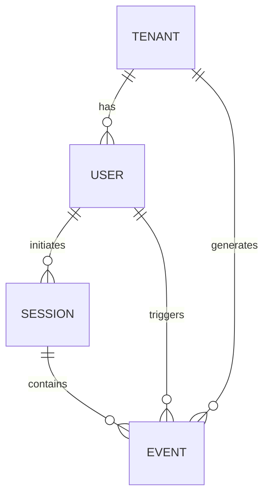

# Data Modeling Requirements Document — GitLab Dedicated Events

> **Version:** 1.0  
> **Last Updated:** 2026-03-16  
> **Owner:** Data Platform Team & Dedicated Platform Engineering  
> **Audience:** Data Engineers, Analytics Engineers, Backend Engineers  

---

## 1. Entity Definitions

### 1.1 Core Entities

| Entity | Description | Primary Key | Source |
|--------|-------------|-------------|--------|
| **Tenant** | A single GitLab Dedicated instance, representing one customer organization. Each tenant has its own isolated infrastructure. | `tenant_id` | Provisioning system / Switchboard |
| **User** | An individual user account within a tenant. Users belong to exactly one tenant. | `user_id` | GitLab user database (anonymized) |
| **Session** | A contiguous period of user activity within the Dedicated instance, typically bound by a browser session or API token usage. | `session_id` | Client SDK / Server session manager |
| **Event** | A discrete action or occurrence tracked by the instrumentation layer. Each event is triggered by a user within a session on a specific tenant. | `event_id` | Snowplow collector / Custom ingestion API |

### 1.2 Entity Relationships

| Relationship | Cardinality | Description |
|-------------|-------------|-------------|
| Tenant → User | One-to-Many | A tenant has many users; a user belongs to exactly one tenant. |
| User → Session | One-to-Many | A user can have many sessions; each session belongs to one user. |
| Session → Event | One-to-Many | A session contains many events; each event belongs to one session. |
| User → Event | One-to-Many | A user triggers many events; each event is triggered by one user. |
| Tenant → Event | One-to-Many | A tenant generates many events; each event belongs to one tenant. |

---

## 2. Required Fields on Every Event Table

Every row in the core events table MUST contain the following fields. All fields are non-nullable unless otherwise specified.

| Field | Data Type | Nullable | Description | Example |
|-------|----------|----------|-------------|---------|
| `event_id` | `VARCHAR(36)` (UUID) | **NOT NULL** | Globally unique identifier for this event instance | `a1b2c3d4-e5f6-7890-abcd-ef1234567890` |
| `event_name` | `VARCHAR(60)` | **NOT NULL** | Event name from the taxonomy (snake_case) | `dedicated_pipeline_executed` |
| `tenant_id` | `VARCHAR(36)` | **NOT NULL** | Dedicated tenant instance identifier | `tenant_acme_prod` |
| `user_id` | `VARCHAR(36)` | **NOT NULL** | Anonymized user identifier | `usr_7f3a8b2c` |
| `session_id` | `VARCHAR(36)` | NULLABLE | Browser or API session identifier (null for server-side events) | `sess_9d4e5f6a` |
| `timestamp` | `TIMESTAMP_TZ` | **NOT NULL** | UTC timestamp of when the event occurred | `2026-03-16T14:32:01.123Z` |
| `platform_version` | `VARCHAR(20)` | **NOT NULL** | GitLab version running on the tenant (semver) | `17.4.2` |
| `event_source` | `VARCHAR(10)` | **NOT NULL** | Where the event was instrumented: `client` or `server` | `client` |
| `received_at` | `TIMESTAMP_TZ` | **NOT NULL** | UTC timestamp when the collector received the event | `2026-03-16T14:32:02.456Z` |
| `loaded_at` | `TIMESTAMP_TZ` | **NOT NULL** | UTC timestamp when the event was loaded into the raw schema | `2026-03-16T15:01:00.000Z` |

---

## 3. Slowly Changing Dimension (SCD) Considerations

Tenant and user metadata changes over time. The data model must capture these changes to enable accurate historical analysis.

### 3.1 Tenant Metadata (SCD Type 2)

Tenant attributes like `plan_tier`, `region`, `seat_limit`, and `sso_enabled` can change over the tenant lifecycle. Use **SCD Type 2** to preserve history.

| Column | Type | Description |
|--------|------|-------------|
| `tenant_id` | `VARCHAR(36)` | Business key (natural key) |
| `tenant_surrogate_key` | `INT` (auto-increment) | Surrogate key for joining |
| `tenant_name` | `VARCHAR(255)` | Tenant display name |
| `region` | `VARCHAR(20)` | AWS region of deployment |
| `plan_tier` | `VARCHAR(30)` | Subscription tier (e.g., `premium`, `ultimate`) |
| `seat_limit` | `INT` | Maximum licensed seats |
| `sso_enabled` | `BOOLEAN` | Whether SSO/SAML is configured |
| `provisioning_date` | `DATE` | Date the tenant was first provisioned |
| `valid_from` | `TIMESTAMP_TZ` | Start of this record's validity period |
| `valid_to` | `TIMESTAMP_TZ` | End of this record's validity (NULL = current) |
| `is_current` | `BOOLEAN` | TRUE if this is the most recent version |

**Implementation notes:**
- When a tenant attribute changes, close the current record (`valid_to = CURRENT_TIMESTAMP`, `is_current = FALSE`) and insert a new record.
- Event-to-tenant joins for historical analysis should use: `event.timestamp BETWEEN tenant.valid_from AND COALESCE(tenant.valid_to, '9999-12-31')`.

### 3.2 User Metadata (SCD Type 2)

User attributes like `role`, `is_active`, and `last_login_at` change over time.

| Column | Type | Description |
|--------|------|-------------|
| `user_id` | `VARCHAR(36)` | Business key |
| `user_surrogate_key` | `INT` | Surrogate key |
| `tenant_id` | `VARCHAR(36)` | Parent tenant |
| `role` | `VARCHAR(30)` | GitLab role (`guest`, `reporter`, `developer`, `maintainer`, `owner`) |
| `is_active` | `BOOLEAN` | Whether the account is currently active |
| `invite_date` | `DATE` | Date the user was first invited |
| `first_login_date` | `DATE` | Date of first successful login |
| `activation_date` | `DATE` | Date the user met activation criteria |
| `valid_from` | `TIMESTAMP_TZ` | SCD validity start |
| `valid_to` | `TIMESTAMP_TZ` | SCD validity end (NULL = current) |
| `is_current` | `BOOLEAN` | TRUE if this is the most recent version |

### 3.3 Session Metadata (SCD Type 1 — Overwrite)

Sessions are ephemeral and do not require historical versioning. Use **SCD Type 1** (overwrite in place).

| Column | Type | Description |
|--------|------|-------------|
| `session_id` | `VARCHAR(36)` | Primary key |
| `user_id` | `VARCHAR(36)` | User who initiated the session |
| `tenant_id` | `VARCHAR(36)` | Tenant context |
| `session_start` | `TIMESTAMP_TZ` | When the session began |
| `session_end` | `TIMESTAMP_TZ` | When the session ended (NULL if active) |
| `session_duration_seconds` | `INT` | Computed: `session_end - session_start` |
| `page_views` | `INT` | Count of navigation events in session |
| `events_count` | `INT` | Total events fired in session |

---

## 4. Data Grain and Partitioning

| Concern | Specification |
|---------|------|
| **Grain** | One row per event occurrence (event-level grain) |
| **Partitioning** | Partition the raw and fact tables by `DATE(timestamp)` for query performance |
| **Clustering** | Cluster by `tenant_id`, `event_name` for common query patterns |
| **Retention** | Raw: 24 months rolling. Transformed: 36 months rolling. Aggregates: indefinite. |

---

## 5. Data Quality Contracts

These are the minimum quality guarantees that engineering must maintain:

| Contract | Specification | Enforcement |
|----------|------|-------------|
| `event_id` uniqueness | No duplicate `event_id` values in the fact table | dbt test: `unique` |
| Required fields non-null | All fields marked NOT NULL must never be null | dbt test: `not_null` |
| Valid event names | `event_name` must exist in the accepted taxonomy list | dbt test: `accepted_values` |
| Referential integrity | Every `tenant_id` in events must exist in `dim_tenants` | dbt test: `relationships` |
| Referential integrity | Every `user_id` in events must exist in `dim_users` | dbt test: `relationships` |
| Timestamp ordering | `received_at >= timestamp` (event can't be received before it happens) | dbt test: custom SQL |
| Freshness | New events must appear in the raw schema within 4 hours of firing | dbt source freshness check |
